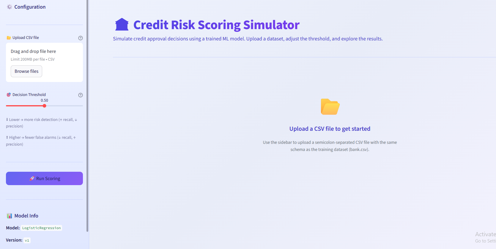
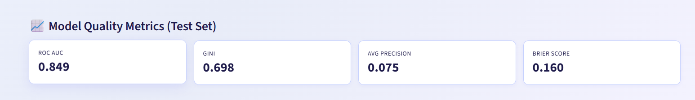
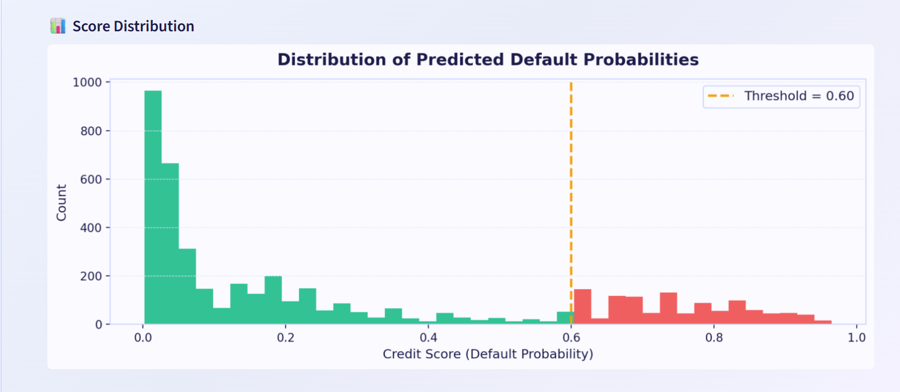
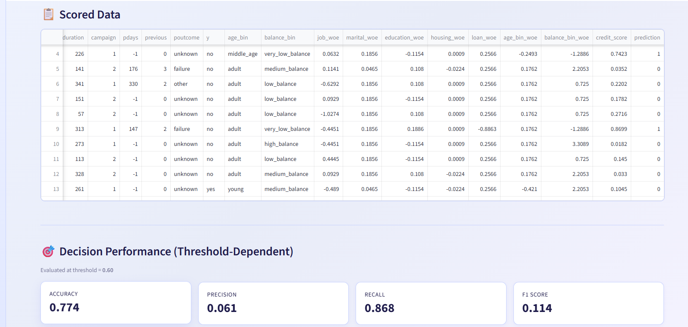
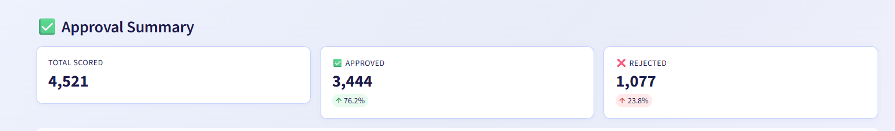
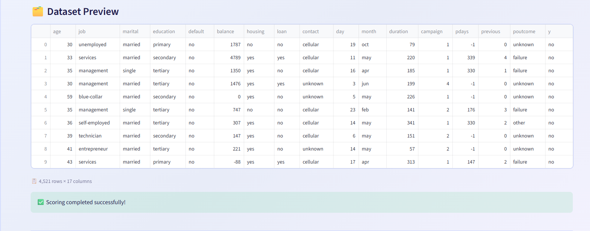

# 📊 Sistema de Puntuación de Riesgo Crediticio con Arquitectura ML Modular

<p align="center">
  <a href="README.md">
    
  </a>
  <a href="#-descripción-del-proyecto">
    
  </a>
</p>

<p align="center">
  
  
  
  
  
  
</p>

<p align="center">
  
</p>

## 📌 Descripción del Proyecto

Este proyecto implementa un **pipeline completo de credit scoring**, diseñado para predecir la probabilidad de incumplimiento (default) de clientes bancarios utilizando técnicas de machine learning.

El enfoque no se limita al modelo, sino que prioriza:

- **Reproducibilidad** — Ejecución consistente del pipeline
- **Modularidad** — Componentes independientes y reutilizables
- **Interpretabilidad** — Fundamental para regulación financiera
- **Preparación para producción** — Versionado de artefactos e inferencia consistente

> [!NOTE]
> El dataset utilizado es el [Bank Marketing Dataset](https://archive.ics.uci.edu/dataset/222/bank+marketing) del repositorio UCI. Se utiliza la columna `default` (si el cliente tiene crédito en mora) como variable objetivo para el modelado de riesgo crediticio.

---

## 🎯 Problema a Resolver

Las instituciones financieras necesitan evaluar el riesgo crediticio antes de otorgar un préstamo.

**Objetivos:**

- Estimar la probabilidad de default (`credit_score`)
- Manejar datos altamente desbalanceados (~1.7% clase positiva)
- Construir un pipeline robusto y reutilizable
- Garantizar consistencia entre entrenamiento e inferencia
- Proveer una herramienta interactiva para análisis de umbrales

---

## 🧠 Características del Dataset

| Propiedad | Descripción |
|---|---|
| **Variable objetivo** | `default_binary` (binaria: 0/1) |
| **Distribución de clases** | ~98.3% sin default / ~1.7% con default (76 de 4,521) |
| **Total de muestras** | 4,521 |
| **Tipos de features** | Predominantemente categóricas (empleo, educación, vivienda, préstamo, etc.) |
| **Features numéricas** | Edad, balance (binneadas en preprocesamiento) |

> [!WARNING]
> Debido al bajo porcentaje de la clase minoritaria (~1.7%), las métricas tradicionales como accuracy **no son adecuadas**. Esto influyó significativamente en la selección de métricas y decisiones de modelado.

---

## 🧩 Arquitectura del Pipeline

```
data/dataset/bank.csv
       │
       ▼
┌─────────────────┐
│  1. Ingesta      │  Validación de esquema, tipos, fallo temprano
└────────┬────────┘
         ▼
┌─────────────────┐
│  2. Creación     │  Variable binaria desde columna 'default'
│     de Target    │
└────────┬────────┘
         ▼
┌─────────────────┐
│  3. Split        │  70/30 estratificado preservando proporciones
│  Estratificado   │
└────────┬────────┘
    ┌────┴────┐
    ▼         ▼
  Train      Test
    │         │
    ▼         ▼
┌────────┐ ┌────────┐
│ Bin +  │ │ Bin +  │
│ WOE    │ │ Aplicar│  ← Usa mappings WOE guardados (sin leakage)
│ Encode │ │ WOE    │
└───┬────┘ └───┬────┘
    │          │
    ▼          ▼
┌─────────────────┐
│  4. Entrena-     │  Logistic Regression + Random Forest
│     miento       │
└────────┬────────┘
         ▼
┌─────────────────┐
│  5. Evaluación   │  AP, ROC AUC, Gini, Brier, F1
└────────┬────────┘
         ▼
┌─────────────────┐
│  6. Selección    │  Filtro por ROC AUC mínimo → maximizar AP
└────────┬────────┘
         ▼
┌─────────────────┐
│  7. Artefactos   │  Guardar modelo + WOE + features + metadata
└─────────────────┘
```

> [!IMPORTANT]
> El split train/test se realiza **antes** de cualquier encoding para prevenir data leakage. Los mappings WOE se calculan exclusivamente sobre el set de entrenamiento y se aplican al set de test usando los mappings guardados.

---

## 📊 Resultados y Rendimiento del Modelo

### Métricas Independientes del Umbral (Test Set)

Estas métricas evalúan la **capacidad de ranking y calidad de probabilidades** del modelo independientemente de cualquier umbral de decisión:

<p align="center">
  
</p>

| Métrica | Valor | Interpretación |
|---|---|---|
| **ROC AUC** | **0.849** | El modelo rankea correctamente un default sobre un no-default **84.9% de las veces**. Valores superiores a 0.80 se consideran buenos en credit scoring. |
| **Coeficiente de Gini** | **0.698** | Métrica estándar de la industria (`2 × AUC − 1`). Un Gini de 0.698 indica **fuerte poder discriminatorio** — muy por encima del umbral de 0.40 típicamente esperado en banca. |
| **Average Precision** | **0.075** | Bajo en términos absolutos, pero **esperado** con solo 1.7% de positivos. Un clasificador aleatorio obtendría ~0.017. Nuestro modelo logra **~4.4× mejor que el azar**. |
| **Brier Score** | **0.160** | Mide calibración de probabilidades (menor es mejor, 0 es perfecto). Un modelo de referencia que predice la tasa de impago base (~1.7%) alcanzaría una puntuación de Brier cercana a 0.016. Nuestra puntuación de 0.160 refleja una calibración de probabilidad imperfecta y pone de manifiesto que hay margen de mejora. |

### Distribución de Scores

El histograma muestra cómo el modelo distribuye las probabilidades de default entre todos los clientes:

<p align="center">
  
</p>

**Observaciones clave:**
- El modelo produce una **separación clara** entre clientes de alto y bajo riesgo
- La mayoría de clientes se concentran en **probabilidades bajas** (< 0.1), como se espera dada la distribución de clases
- Una cola distinta de **clientes de alto riesgo** aparece por encima de 0.6
- La línea punteada representa el **umbral de decisión** ajustable — todos los clientes a la derecha son marcados como potenciales defaults

### Métricas Dependientes del Umbral (Ejemplo con threshold = 0.60)

Estas métricas cambian según el umbral elegido y representan el **trade-off operacional**:

<p align="center">
  
</p>

| Métrica | Valor | Interpretación |
|---|---|---|
| **Accuracy** | 0.774 | Engañoso en escenarios desbalanceados — un clasificador que predice siempre "no default" obtiene 98.3% |
| **Precision** | 0.061 | De los clientes marcados como default, 6.1% realmente lo son. Bajo debido al desbalanceo extremo |
| **Recall** | 0.868 | El modelo captura **86.8% de los defaults reales** — crítico para gestión de riesgos |
| **F1 Score** | 0.114 | Media armónica de precision y recall. F1 bajo es esperado y **no es un fallo** — refleja la realidad matemática del desbalanceo |

> [!IMPORTANT]
> **¿Por qué la precisión es tan baja?** Con solo 76 defaults en 4,521 registros (1.7%), incluso un buen modelo marcará muchos no-defaults. Este es el **trade-off precision-recall** inherente a problemas desbalanceados. En credit scoring, el **recall alto** (capturar la mayoría de defaults) generalmente se prioriza sobre la precisión alta, ya que el costo de no detectar un default es mucho mayor que el costo de revisiones adicionales.

### Resumen de Aprobación

<p align="center">
  
</p>

Con threshold = 0.60: **3,444 aprobados (76.2%)** | **1,077 rechazados (23.8%)**

---

## 🖥️ Simulador Interactivo de Scoring

El proyecto incluye una **aplicación web en Streamlit** para scoring de riesgo crediticio interactivo:

<p align="center">
  
</p>

**Funcionalidades:**
- 📂 Subir cualquier CSV con el esquema de datos bancarios
- 🎯 Ajustar el umbral de decisión en tiempo real
- 📊 Visualizar distribuciones de score con histogramas coloreados
- ✅ Ver resúmenes de aprobación/rechazo
- 🎯 Analizar métricas dependientes del umbral (cuando existe ground truth)
- 📈 Ver métricas oficiales de calidad del modelo

```bash
streamlit run app.py
```

---

## 🏆 Selección del Modelo

Un módulo personalizado `select_best_model` automatiza la selección:

1. **Filtra** modelos por un umbral mínimo de ROC AUC (≥ 0.75)
2. **Ordena** los modelos válidos por la métrica primaria (Average Precision)
3. **Desempata** usando una métrica secundaria (Brier Score, menor es mejor)

**Selección final: Logistic Regression** superó a Random Forest:

- Mayor capacidad de ranking (ROC AUC y Gini)
- Mayor estabilidad frente al desbalanceo severo
- Mayor interpretabilidad — fundamental en credit scoring por regulación

---

## 📦 Gestión de Artefactos

El modelo final se guarda como un **artefacto versionado** usando `joblib`:

```
artifacts/
└── model_v1/
    └── model.joblib    # modelo + mappings WOE + features + metadata + métricas
```

Esto garantiza **reproducibilidad**, **trazabilidad**, y permite actualizaciones seguras (`model_v2`, `model_v3`, etc.).

---

## 📁 Estructura del Proyecto

```
credit_scoring/
├── main.py                          # Orquestador del pipeline
├── app.py                           # Simulador de scoring (Streamlit)
├── run_inference.py                 # Script de inferencia CLI
├── requirements.txt
├── README.md                        # Documentación (English)
├── README.es.md                     # Documentación (Español)
├── data/
│   └── dataset/
│       └── bank.csv
├── artifacts/
│   └── model_v1/
│       └── model.joblib
├── images/                          # Screenshots para documentación
├── notebooks/
│   └── 01_exploratory_data_analysis.ipynb
└── source/
    ├── ingestion/
    │   └── load_data.py
    ├── preprocessing/
    │   └── feature_engineering.py
    ├── training/
    │   └── model_training.py
    ├── evaluation/
    │   ├── model_evaluation.py
    │   └── model_selection.py
    ├── inference/
    │   └── inference_pipeline.py
    └── artifacts/
        └── artifact_manager.py
```

---

## 📌 Conclusiones

1. **ROC AUC de 0.849 y Gini de 0.698** demuestran que el modelo tiene fuerte poder discriminatorio para separar defaulters de non-defaulters
2. **AP y F1 bajos son esperados**, no un fallo — reflejan la realidad matemática del desbalanceo extremo de clases (1.7% positivos)
3. **Logistic Regression superó a Random Forest**, confirmando que modelos simples e interpretables pueden destacar en credit scoring
4. **El diseño del pipeline importa más** que perseguir ganancias métricas marginales — split antes del encoding, versionado de artefactos, y consistencia en inferencia son clave
5. **Un simulador interactivo** permite a stakeholders explorar trade-offs de umbral sin tocar código

---

## 🚀 Trabajo Futuro

- [ ] Agregar **XGBoost** con restricciones monótonas
- [ ] Implementar **validación cruzada** para robustez
- [ ] Construir **despliegue vía API** (FastAPI)
- [ ] Agregar interface de **scoring por lotes**
- [ ] Implementar **monitoreo y detección de drift**
- [ ] Mejorar **calibración de probabilidades** (Platt scaling / regresión isotónica)

---

## ⚙️ Instalación y Uso

```bash
# Crear entorno
conda create -n credit_scoring python=3.11 numpy=1.26 pandas scipy scikit-learn matplotlib seaborn joblib streamlit

# Activar entorno
conda activate credit_scoring

# Entrenar pipeline
python main.py

# Ejecutar app de Streamlit
streamlit run app.py

# Ejecutar inferencia CLI
python run_inference.py
```
